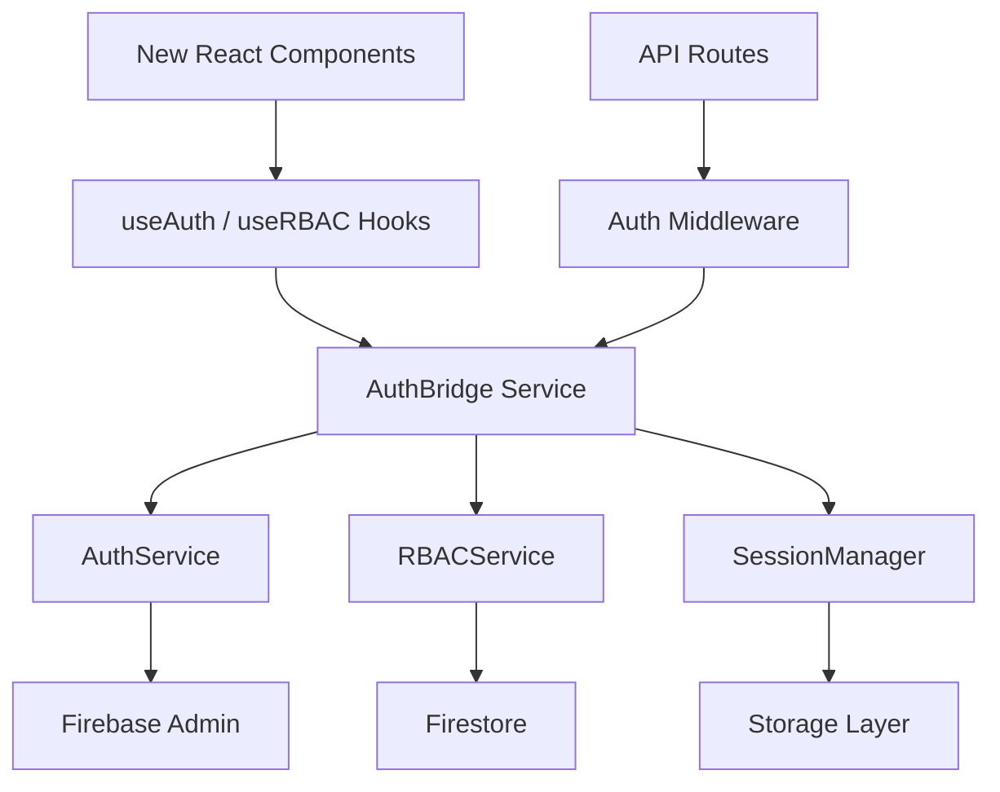

# Authentication Integration Guide

This guide explains how to integrate the new authentication compatibility layer into your application, providing a bridge between the extracted authentication services and new UI components.

## Table of Contents

1. [Overview](#overview)
2. [Architecture](#architecture)
3. [Quick Start](#quick-start)
4. [Components](#components)
5. [Usage Examples](#usage-examples)
6. [Migration Guide](#migration-guide)
7. [API Reference](#api-reference)
8. [Security Considerations](#security-considerations)
9. [Troubleshooting](#troubleshooting)

## Overview

The authentication compatibility layer consists of several key components:

- **AuthBridge**: Main service for UI integration
- **AuthMiddleware**: Token validation for API routes  
- **SessionManager**: Session persistence and management
- **React Hooks**: useAuth and useRBAC for new components
- **API Protection**: Rate limiting, CORS, and security

### Key Features

✅ **Firebase Token Compatibility** - Works with existing Firebase tokens and custom claims  
✅ **RBAC Integration** - Preserves existing role hierarchy (super_admin → coach → creator)  
✅ **Security Patterns** - Maintains all existing security patterns and access controls  
✅ **Clean React Interface** - Modern hooks-based API for new components  
✅ **Session Management** - Automatic refresh, persistence, and cleanup  
✅ **API Protection** - Rate limiting, CORS, validation, and security headers

## Architecture



### Component Responsibilities

| Component | Purpose |
|-----------|---------|
| **AuthBridge** | Main orchestrator for UI authentication |
| **AuthService** | Firebase token validation and user management |
| **RBACService** | Role-based access control and permissions |
| **SessionManager** | Session persistence and lifecycle management |
| **AuthMiddleware** | API route protection and validation |
| **API Protection** | Rate limiting, CORS, and security |

## Quick Start

### 1. Environment Setup

Ensure your environment variables are configured:

```bash
# Firebase Configuration
NEXT_PUBLIC_FIREBASE_PROJECT_ID=your-project-id
FIREBASE_PRIVATE_KEY=your-private-key
FIREBASE_CLIENT_EMAIL=your-client-email

# Optional: Session Configuration
SESSION_SECRET=your-session-secret
SESSION_MAX_AGE=432000000  # 5 days in milliseconds
```

### 2. Initialize Services

```typescript
// lib/auth-setup.ts
import { createAuthServiceFromEnv } from '@/services/auth';
import { createRBACService } from '@/services/auth';
import { createAuthBridge } from '@/lib/auth-bridge';
import { createSessionManager } from '@/lib/auth-session';

// Initialize services
export const authService = createAuthServiceFromEnv();
export const rbacService = createRBACService(/* firestore instance */, /* user management adapter */);
export const authBridge = createAuthBridge(authService, rbacService);
export const sessionManager = createSessionManager(authBridge);
```

### 3. Create Authentication Context (Optional)

```typescript
// contexts/auth-context.tsx
'use client';

import { createContext, useContext, ReactNode } from 'react';
import { authBridge } from '@/lib/auth-setup';
import { AuthBridge } from '@/lib/auth-bridge';

const AuthContext = createContext<AuthBridge | null>(null);

export function AuthProvider({ children }: { children: ReactNode }) {
  return (
    <AuthContext.Provider value={authBridge}>
      {children}
    </AuthContext.Provider>
  );
}

export function useAuthBridge() {
  const bridge = useContext(AuthContext);
  if (!bridge) {
    throw new Error('useAuthBridge must be used within AuthProvider');
  }
  return bridge;
}
```

### 4. Use in Components

```typescript
// components/profile.tsx
'use client';

import { useAuth, useRBAC } from '@/hooks/use-auth';
import { useAuthBridge } from '@/contexts/auth-context';

export function UserProfile() {
  const authBridge = useAuthBridge();
  const { user, loading, signOut } = useAuth(authBridge);
  const { isSuperAdmin, canManageUsers } = useRBAC(authBridge);
  
  if (loading) return <div>Loading...</div>;
  if (!user) return <div>Please sign in</div>;
  
  return (
    <div>
      <h1>Welcome, {user.displayName}</h1>
      <p>Email: {user.email}</p>
      
      {isSuperAdmin && (
        <div>Super Admin Controls</div>
      )}
      
      {canManageUsers && (
        <button>Manage Users</button>
      )}
      
      <button onClick={signOut}>Sign Out</button>
    </div>
  );
}
```

## Components

### AuthBridge

The main service that bridges extracted services with new UI components.

**Key Methods:**
- `authenticateWithToken(token)` - Authenticate with Firebase ID token
- `authenticateWithSessionCookie(cookie)` - Authenticate with session cookie
- `signOut()` - Sign out current user
- `hasPermission(action, resourceType, resourceId?)` - Check permissions
- `hasRole(role)` - Check user role

**Events:**
- `onAuthStateChanged(callback)` - Listen to auth state changes
- `onRBACStateChanged(callback)` - Listen to RBAC context changes

### SessionManager

Handles session persistence, refresh, and cleanup.

**Configuration:**
```typescript
const sessionManager = createSessionManager(authBridge, {
  storage: {
    storageType: 'localStorage', // 'memory', 'sessionStorage', 'cookie'
    secureCookies: true
  },
  maxAge: 5 * 24 * 60 * 60 * 1000, // 5 days
  autoRefresh: true,
  csrfProtection: true
});
```

### React Hooks

#### useAuth Hook

```typescript
const {
  user,              // Current user object
  loading,           // Authentication loading state
  error,             // Authentication error
  isAuthenticated,   // Boolean auth status
  signInWithToken,   // Sign in method
  signOut,           // Sign out method
  currentSession,    // Current session info
  getAuthorizationHeader // Get bearer token for API calls
} = useAuth(authBridge);
```

#### useRBAC Hook

```typescript
const {
  context,           // RBAC context
  permissions,       // User permissions object
  userRole,          // User's role string
  isSuperAdmin,      // Super admin boolean
  accessibleCoaches, // Accessible coach IDs
  hasPermission,     // Permission checker function
  hasRole,           // Role checker function
  canCreateCollections,
  canDeleteAnyCollection,
  canAccessAllVideos,
  canManageUsers
} = useRBAC(authBridge);
```

### API Middleware

Protects API routes with authentication and authorization.

```typescript
// api/protected/route.ts
import { NextRequest } from 'next/server';
import { createAuthMiddleware } from '@/lib/auth-middleware';
import { authBridge } from '@/lib/auth-setup';

const middleware = createAuthMiddleware(authBridge);

export async function GET(request: NextRequest) {
  return middleware.nextjs.withAuth(async (req, context) => {
    // context.user - authenticated user
    // context.userContext - RBAC context
    
    return Response.json({
      message: `Hello ${context.user.displayName}!`,
      role: context.userContext.role
    });
  }, {
    requireAuth: true,
    requiredRole: 'coach'
  })(request);
}
```

### API Protection

Comprehensive API protection with rate limiting, CORS, and validation.

```typescript
// middleware.ts
import { NextRequest } from 'next/server';
import { createSecureAPI } from '@/lib/api-protection';
import { authBridge } from '@/lib/auth-setup';

const apiProtection = createSecureAPI(authBridge, {
  rateLimit: {
    windowMs: 15 * 60 * 1000, // 15 minutes
    maxRequests: 100
  },
  cors: {
    origin: ['https://yourdomain.com'],
    credentials: true
  },
  requireAuth: true,
  securityHeaders: true
});

export async function middleware(request: NextRequest) {
  if (request.nextUrl.pathname.startsWith('/api/protected')) {
    return apiProtection.protect(request);
  }
}
```

## Usage Examples

### Protected Component

```typescript
'use client';

import { useAuth, useRBAC } from '@/hooks/use-auth';
import { PermissionGuard, RoleGuard } from '@/hooks/use-rbac-new';

export function ProtectedContent({ authBridge }: { authBridge: AuthBridge }) {
  const { user, loading } = useAuth(authBridge);
  
  if (loading) return <div>Loading...</div>;
  if (!user) return <div>Sign in required</div>;
  
  return (
    <div>
      <h1>Protected Content</h1>
      
      {/* Show for super admins only */}
      <RoleGuard 
        roles="super_admin" 
        authBridge={authBridge}
        fallback={<div>Admin only content hidden</div>}
      >
        <div>Super Admin Panel</div>
      </RoleGuard>
      
      {/* Show based on permissions */}
      <PermissionGuard
        action="write"
        resourceType="collection"
        authBridge={authBridge}
        fallback={<div>Read-only mode</div>}
      >
        <button>Create Collection</button>
      </PermissionGuard>
    </div>
  );
}
```

### API Route with Validation

```typescript
// api/collections/route.ts
import { NextRequest } from 'next/server';
import { createAPIProtection, ValidationRules } from '@/lib/api-protection';
import { authBridge } from '@/lib/auth-setup';

const protection = createAPIProtection(authBridge, {
  requireAuth: true,
  validation: [
    ValidationRules.nonEmptyString('title'),
    {
      field: 'description',
      type: 'string',
      maxLength: 500
    }
  ]
});

export const POST = protection.createProtectedHandler(async (request, context) => {
  const body = await request.json();
  
  // Create collection logic here
  // context.user contains authenticated user
  
  return Response.json({
    success: true,
    collectionId: 'new-collection-id'
  });
});
```

### Session Management

```typescript
'use client';

import { useEffect } from 'react';
import { createSessionManager } from '@/lib/auth-session';

export function SessionProvider({ children, authBridge }) {
  useEffect(() => {
    const sessionManager = createSessionManager(authBridge, {
      storage: { storageType: 'localStorage' },
      autoRefresh: true,
      cleanupInterval: 10 * 60 * 1000 // 10 minutes
    });
    
    // Listen to session events
    const unsubscribe = sessionManager.addEventListener((event) => {
      console.log('Session event:', event.type, event);
      
      if (event.type === 'expired') {
        // Handle session expiration
        window.location.href = '/login';
      }
    });
    
    return () => {
      unsubscribe();
      sessionManager.dispose();
    };
  }, [authBridge]);
  
  return <>{children}</>;
}
```

### RBAC Permission Checking

```typescript
'use client';

import { useCallback } from 'react';
import { useRBAC } from '@/hooks/use-rbac-new';

export function CollectionActions({ collectionId, authBridge }) {
  const { hasPermission } = useRBAC(authBridge);
  
  const handleEdit = useCallback(async () => {
    const canEdit = await hasPermission('write', 'collection', collectionId);
    
    if (canEdit) {
      // Proceed with edit
      console.log('User can edit collection');
    } else {
      alert('You do not have permission to edit this collection');
    }
  }, [hasPermission, collectionId]);
  
  const handleDelete = useCallback(async () => {
    const canDelete = await hasPermission('delete', 'collection', collectionId);
    
    if (canDelete && confirm('Are you sure?')) {
      // Proceed with delete
      console.log('User can delete collection');
    }
  }, [hasPermission, collectionId]);
  
  return (
    <div>
      <button onClick={handleEdit}>Edit</button>
      <button onClick={handleDelete}>Delete</button>
    </div>
  );
}
```

## Migration Guide

### From Legacy Auth System

1. **Replace Auth Context**:
   ```typescript
   // Old
   const { user } = useAuth(); // from old context
   
   // New
   const { user } = useAuth(authBridge);
   ```

2. **Update Permission Checks**:
   ```typescript
   // Old
   const { canWrite } = useRBAC();
   
   // New
   const { hasPermission } = useRBAC(authBridge);
   const canWrite = await hasPermission('write', 'collection');
   ```

3. **Replace API Authentication**:
   ```typescript
   // Old
   export async function GET(request: NextRequest) {
     // Custom auth logic
   }
   
   // New
   const middleware = createAuthMiddleware(authBridge);
   export const GET = middleware.nextjs.withAuth(handler, { requireAuth: true });
   ```

### Gradual Migration Strategy

1. **Phase 1**: Set up new services alongside existing ones
2. **Phase 2**: Migrate new components to use new hooks
3. **Phase 3**: Update API routes to use new middleware
4. **Phase 4**: Remove legacy authentication code

## API Reference

### AuthBridge Methods

```typescript
interface AuthBridge {
  // Initialization
  initialize(): Promise<void>;
  dispose(): Promise<void>;
  
  // Authentication
  authenticateWithToken(token: string): Promise<SessionInfo>;
  authenticateWithSessionCookie(cookie: string): Promise<SessionInfo>;
  signOut(): Promise<void>;
  
  // State
  getCurrentUser(): FirebaseUser | null;
  getCurrentSession(): SessionInfo | null;
  isAuthenticated(): boolean;
  
  // RBAC
  loadRBACContext(userId?: string): Promise<RBACContext>;
  hasPermission(action, resourceType, resourceId?): Promise<boolean>;
  hasRole(role: string): Promise<boolean>;
  getAccessibleCoaches(): Promise<string[]>;
  
  // Events
  onAuthStateChanged(callback): () => void;
  onRBACStateChanged(callback): () => void;
  
  // Utilities
  getAuthorizationHeader(): string | null;
  validateCurrentSession(): Promise<boolean>;
}
```

### Hook Configurations

```typescript
// useAuth configuration
interface UseAuthConfig {
  autoRefresh?: boolean;
  persistSession?: boolean;
  onError?: (error: AuthError) => void;
  onSignIn?: (user: FirebaseUser) => void;
  onSignOut?: () => void;
}

// useRBAC configuration
interface UseRBACConfig {
  autoLoad?: boolean;
  onContextChange?: (context: RBACContext | null) => void;
  onError?: (error: AuthError) => void;
}
```

### Middleware Options

```typescript
interface MiddlewareConfig {
  requiredRole?: UserRole | UserRole[];
  requireAuth?: boolean;
  allowAnonymous?: boolean;
  skipTokenValidation?: boolean;
}
```

### API Protection Config

```typescript
interface APIProtectionConfig {
  rateLimit?: {
    windowMs: number;
    maxRequests: number;
    message?: string;
  };
  cors?: {
    origin?: string | string[];
    methods?: string[];
    credentials?: boolean;
  };
  validation?: ValidationRule[];
  requireAuth?: boolean;
  requiredRole?: UserRole | UserRole[];
  securityHeaders?: boolean;
  logging?: boolean;
}
```

## Security Considerations

### Token Security

- Tokens are validated on every request using Firebase Admin SDK
- Session cookies are httpOnly and secure in production
- Automatic token refresh prevents expired token issues
- Rate limiting prevents token brute force attacks

### RBAC Security

- Role hierarchy is enforced at the service level
- Permissions are checked server-side for sensitive operations
- Coach access patterns are preserved from original system
- Super admin privileges are carefully controlled

### Session Security

- Sessions have configurable expiration times
- CSRF protection available for state-changing operations
- Session cleanup prevents memory leaks
- Multiple storage options for different security needs

### API Security

- Request validation prevents injection attacks
- Rate limiting prevents abuse
- CORS configuration controls cross-origin access
- Security headers protect against common vulnerabilities

### Best Practices

1. **Always validate permissions server-side** for sensitive operations
2. **Use HTTPS in production** to protect tokens in transit
3. **Configure CORS properly** to prevent unauthorized access
4. **Implement proper error handling** to avoid information leakage
5. **Regular security audits** of authentication flows

## Troubleshooting

### Common Issues

#### 1. Authentication Initialization Errors

**Problem**: `Auth service not initialized` error

**Solution**:
```typescript
// Ensure proper initialization order
await authService.initialize();
await authBridge.initialize();
```

#### 2. Permission Checks Failing

**Problem**: `hasPermission` always returns false

**Causes**:
- RBAC context not loaded
- User not authenticated
- Incorrect resource ID

**Solution**:
```typescript
// Check auth state first
const { user, isAuthenticated } = useAuth(authBridge);
const { context, loading } = useRBAC(authBridge);

if (!isAuthenticated || !user) {
  // User needs to authenticate
}

if (loading) {
  // Wait for RBAC context to load
}
```

#### 3. Session Persistence Issues

**Problem**: User gets logged out on page refresh

**Causes**:
- Session storage not configured
- Session cookies not being set
- Session expiration too short

**Solution**:
```typescript
const sessionManager = createSessionManager(authBridge, {
  storage: { 
    storageType: 'localStorage', // Persist across tabs
    secureCookies: true 
  },
  maxAge: 7 * 24 * 60 * 60 * 1000, // 1 week
  autoRefresh: true
});
```

#### 4. Rate Limiting Triggered

**Problem**: Getting 429 Too Many Requests errors

**Solution**:
```typescript
// Adjust rate limiting for your use case
const apiProtection = createAPIProtection(authBridge, {
  rateLimit: {
    windowMs: 15 * 60 * 1000, // 15 minutes
    maxRequests: 1000, // Increase limit
    keyGenerator: (req) => {
      // Custom key generation (e.g., per user instead of per IP)
      return req.user?.uid || req.ip;
    }
  }
});
```

#### 5. CORS Issues

**Problem**: Cross-origin requests being blocked

**Solution**:
```typescript
const corsConfig = {
  origin: [
    'http://localhost:3000',
    'https://yourdomain.com',
    'https://staging.yourdomain.com'
  ],
  credentials: true,
  methods: ['GET', 'POST', 'PUT', 'DELETE']
};
```

### Debug Mode

Enable detailed logging for troubleshooting:

```typescript
const authBridge = createAuthBridge(authService, rbacService, {
  enableLogging: true // Add logging to AuthBridge
});

const apiProtection = createAPIProtection(authBridge, {
  logging: true // Enable API request logging
});
```

### Support

For additional help:

1. Check the extracted services documentation in `/src/services/auth/README.md`
2. Review the existing RBAC patterns in your codebase
3. Test authentication flows in development environment
4. Monitor server logs for detailed error messages

---

This integration guide should provide everything needed to successfully implement the authentication compatibility layer in your new application while maintaining full compatibility with existing Firebase tokens and RBAC systems.